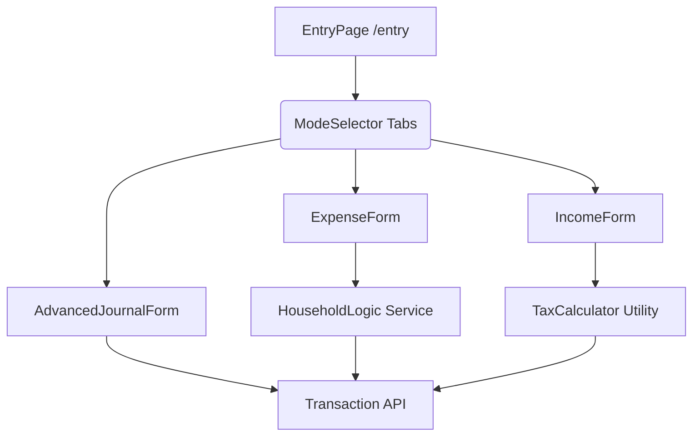

# 🔱 統合入力センター (Universal Entry Portal) 設計提案書

> **現状の課題**: 入金（売上）、出金（経費）、家庭内支出（家計簿）の入力画面が分かれているため、社長の貴重なリソースが「画面の回遊」に消費されている。  
> **解決策**: すべての「お金の動き」を一つのポートで受け止める、統合入力インターフェースを導入する。

---

## 🎨 画面設計案：Universal Entry UI

画面上部に、3つのモードを選択するセグメントコントロール（タブ）を配置します。

### 1. 【支出モード】 (Daily Expense / Business & Home)
「日常の買い物」や「経費支払い」に特化した、最も利用頻度の高いモードです。

| 項目 | 内容 | 備考 |
|---|---|---|
| **日付** | 取引日 (YYYY-MM-DD) | デフォルトは当日 |
| **内容** | 摘要（店舗名など） | AIサジェスト機能付き |
| **金額** | ¥ 支出合計額 | |
| **区分トグル** | [ ビジネス ] / [ プライベート ] | 切り替えで詳細項目が変化 |

- **ビジネス選択時**: 「勘定科目」選択、またはAIによる自動推論。
- **プライベート選択時**: 
    - 「事業経費として計上」チェックボックス。
    - 按分割合の簡易表示。

### 2. 【収入モード】 (Revenue / Income)
売上や給与など、入金に関するすべての記録を扱います。

- **入力項目**: 額面 (Gross)、振込額 (Net)、摘要、入金先口座。
- **自動化**: 特定の固定客（取引先）を設定すると、源泉徴収税を自動逆算。

### 3. 【詳細モード】 (Universal Journal)
振替や複雑な仕訳、会計上のテクニカルな修正に使用します。
- 既存の「手動仕訳入力」の柔軟なスプリット行形式をそのまま提供。

---

## 🛠️ コンポーネント構成案 (Tech Stack)

統合UIは、以下のコンポーネントで構成することを提案します。

---

## 💾 データ連携の仕組み

統合UIで入力されたデータは、バックエンドで以下のように処理されます。

1. **家計簿データ**: 全モード共通で `HouseholdSpending` テーブルへ。
2. **事業データ**: 「ビジネス」判定時または「同期」ON時に、`Transaction` + `JournalEntry` を一括作成。
3. **リレーション**: `transactionId` を付与することで、家計簿から事業データ、あるいはその逆へのシームレスなジャンプを実現。

---

## 🚀 今後のロードマップ（計画）

1. **Phase 1**: 新規ページ `/entry` のモックアップ作成。
2. **Phase 2**: 収入・支出それぞれの「簡易入力ロジック」を既存APIにブリッジ。
3. **Phase 3**: 旧画面（`/sales`, `/household/entry`, `/journal`）から新画面へのリダイレクト、およびナビゲーション統合。

---
> [!NOTE]
> 本書は「プログラムの変更前の設計案」です。社長の承認が得られ次第、実装フェーズに移行可能です。

**KIRUMA COMPANY 技術局 / 切間 凛太郎**
